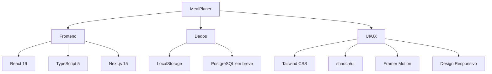

# <div align="center">🏋️‍♂️ MealPlaner</div>

<div align="center">
  <h3>✨ Gestão de Treinos & Dieta para o Atleta Moderno ✨</h3>
</div>

<div align="center">
  
  
  
  
</div>

<br/>

<div align="center">
  Uma aplicação web moderna para gerir treinos e nutrição de forma científica e intuitiva.
  <br/>
  Desenvolvida com React 19, Next.js 15, Tailwind CSS e shadcn/ui para uma experiência fluida em qualquer dispositivo.
</div>

<br/>

## 📱 Compatibilidade

| Plataforma | Estado | Notas |
|------------|:------:|-------|
| 💻 Windows/macOS/Linux | ✅ | Experiência completa com layout otimizado |
| 📱 Android/iOS | ✅ | Interface adaptativa para telas menores |
| 📱 Tablets | ✅ | Layout híbrido com todas as funcionalidades |
| 🌐 PWA | 🔜 | Instalação como app nativa em breve |

<br/>

## ✨ Principais Recursos

<table>
  <tr>
    <td width="33%">
      <h3 align="center">💪 Treinos</h3>
      <ul>
        <li>🏃‍♂️ Gestão completa de exercícios</li>
        <li>📝 Planos de treino personalizados</li>
        <li>📊 Acompanhamento de progressão</li>
        <li>🗓️ Organização semanal inteligente</li>
      </ul>
    </td>
    <td width="33%">
      <h3 align="center">🥗 Nutrição</h3>
      <ul>
        <li>🍎 Biblioteca de alimentos detalhada</li>
        <li>🍱 Criação de refeições personalizadas</li>
        <li>📈 Monitorização de macronutrientes</li>
        <li>🎯 Metas adaptativas por fase</li>
      </ul>
    </td>
    <td width="33%">
      <h3 align="center">⚖️ Monitorização</h3>
      <ul>
        <li>📏 Acompanhamento de métricas corporais</li>
        <li>📊 Visualização em gráficos</li>
        <li>📜 Histórico completo</li>
        <li>📉 Análises de tendências</li>
      </ul>
    </td>
  </tr>
</table>

<br/>

## 🚀 Comece Já

### Acesse a Aplicação

```
🔗 URL: mealplaner.marquesserver.freeddns.org:7171
⏰ Disponibilidade: 07:00-00:00 (GMT+1)
```

> O servidor está offline entre as 00:00 e as 07:00 para otimização energética

<br/>

## 🛠️ Stack Tecnológica



<br/>

## 📊 Funcionalidades em Detalhe

### 💪 Sistema de Treino

<details>
<summary><b>🏋️‍♂️ Gestão de Exercícios</b> (clique para expandir)</summary>
<br/>

- **🗂️ Biblioteca Completa:**
  - Criar, editar e remover exercícios personalizados
  - Definir séries, repetições e tempo de descanso
  - Organização por grupos musculares
  
- **👀 Visualização Interativa:**
  - Modo expandido/minimizado para detalhes
  - Feedback visual de progresso
  - Interface otimizada para uso durante o treino

</details>

<details>
<summary><b>📋 Planos de Treino</b> (clique para expandir)</summary>
<br/>

- **📅 Organização Personalizada:**
  - Criar treinos específicos (ex: Peito e Tríceps)
  - Organização semanal flexível
  - Alternância automática de rotinas

- **📝 Registo de Performance:**
  - Histórico detalhado por exercício
  - Acompanhamento de evolução de cargas
  - Comparação entre sessões
  
```typescript
// Exemplo de estrutura de dados
interface TreinoSemanal {
  segunda: Treino[];
  terca: Treino[];
  quarta: Treino[];
  quinta: Treino[];
  sexta: Treino[];
  sabado: Treino[];
  domingo: Treino[];
}
```

</details>

### 🥗 Sistema de Nutrição

<details>
<summary><b>🍎 Gestão de Alimentos</b> (clique para expandir)</summary>
<br/>

- **🏪 Base de Dados Nutricional:**
  - Alimentos com informação por 100g
  - Macronutrientes detalhados (proteínas, carboidratos, gorduras)
  - Personalização completa com interface intuitiva
  
- **🍱 Composição de Pratos:**
  - Combine alimentos com quantidades específicas
  - Cálculo automático de valores nutricionais
  - Biblioteca de pratos reutilizáveis
  - Validação inteligente de macronutrientes

- **🧮 Cálculo Avançado:**
  - Verificação automática de discrepâncias de macros
  - Alertas visuais para desequilíbrios
  - Distribuição percentual por refeição

</details>

<details>
<summary><b>🎯 Sistema de Metas</b> (clique para expandir)</summary>
<br/>

- **🔍 Objetivos Personalizados:**
  - Definição de calorias diárias
  - Distribuição percentual por macronutriente
  - Distribuição por refeição (pequeno-almoço, almoço, lanche, jantar)
  - Adaptação a diferentes fases (corte, volume, manutenção)

- **📊 Monitorização em Tempo Real:**
  - Dashboard de consumo diário
  - Alertas de desvio de metas
  - Sugestões adaptativas
  - Feedback visual colorido por faixa de adequação

- **🔄 Sistema de Sequência:**
  - Acompanhamento de dias consecutivos de adesão à dieta
  - Recompensas visuais por consistência
  - Histórico de aderência ao plano

</details>

### ⚖️ Acompanhamento de Progresso

<details>
<summary><b>📏 Métricas Corporais</b> (clique para expandir)</summary>
<br/>

- **📝 Registo Completo:**
  - Peso corporal
  - Percentual de gordura
  - Massa muscular (kg e %)
  - Água corporal (%)
  - Gordura visceral
  - Medidas específicas
  
- **📈 Análise de Tendências:**
  - Visualização gráfica de evolução
  - Correlação com dieta e treino
  - Cálculo automático de IMC com categorização
  - Comparação com medições anteriores

- **💾 Armazenamento:**
  - Sincronização automática com localStorage
  - Persistência entre sessões
  - Backup e restauração (em breve)
  
</details>

<br/>

## 🏠 Interface Principal

O dashboard principal apresenta um resumo de todas as áreas:

- **🔍 Visão Geral:** Métricas-chave, metas diárias, próximos treinos
- **📅 Streaks:** Sistema de sequências para treino e dieta
- **💪 Treino do Dia:** Rápido acesso ao treino programado
- **🥗 Metas Nutricionais:** Distribuição visual de macros
- **⚖️ Evolução Corporal:** Últimas medições e tendências
- **💡 Dica do Dia:** Conselhos diários para motivação

<br/>

## 🔧 Arquitetura & Implementação

- **📱 Design Responsivo:** Interface adaptada para qualquer dispositivo
- **🧩 Componentização:** Estrutura modular para fácil manutenção
- **📦 Estado Local:** Gerenciamento de estado com useLocalStorage para persistência
- **🎨 UI Moderna:** Uso de shadcn/ui e Tailwind para consistência visual
- **🔄 Animações:** Transições suaves com Framer Motion
- **📣 Notificações:** Sistema de toasts para feedback ao usuário

<br/>

## 🛡️ Segurança e Armazenamento

Atualmente, os dados são armazenados localmente (localStorage) com:

- ✅ Criptografia básica para proteção
- ✅ Verificação de integridade
- ✅ Sistema de recuperação

**Em Breve:**
- ☁️ Sincronização na nuvem
- 🔐 Autenticação de utilizadores
- 📊 Análises avançadas

<br/>

## 🔮 Roadmap

| Funcionalidade | Prioridade | Estado |
|----------------|:----------:|:------:|
| 🗃️ Base de dados PostgreSQL | 🔥 Alta | 🔜 Em breve |
| 🔐 Autenticação de usuários | 🔥 Alta | 🔜 Em breve |
| 🌙 Modo escuro | 🔄 Média | 🔜 Em breve |
| 📱 Versão PWA | 🔄 Média | 🔄 Em desenvolvimento |
| 📊 Gráficos avançados | 🔄 Média | 📝 Planeado |
| 📥 Exportação de dados | 🔄 Média | 📝 Planeado |
| 🔄 Sistema de backup/restore | 🔄 Média | 📝 Planeado |
| 🤝 Partilha de planos | 💤 Baixa | 📝 Planeado |
| 🔔 Notificações | 💤 Baixa | 📝 Planeado |

<br/>

## 🤝 Contribuições

Contribuições são bem-vindas! Siga estes passos para contribuir com o projeto:

### Como contribuir

1. **🍴 Fork o repositório:**
   - Clique no botão "Fork" no canto superior direito do repositório no GitHub

2. **📥 Clone seu fork:**
   ```bash
   git clone https://github.com/seu-usuario/MealPlaner.git
   cd MealPlaner
   ```

3. **🔄 Configure o repositório upstream:**
   ```bash
   git remote add upstream https://github.com/usuario-original/MealPlaner.git
   ```

4. **🌿 Crie uma branch para sua contribuição:**
   ```bash
   git checkout -b minha-contribuicao
   ```

5. **✏️ Faça suas alterações:**
   - Implemente novas funcionalidades ou correções
   - Siga o estilo de código existente
   - Adicione testes se possível

6. **📤 Commit e push das alterações:**
   ```bash
   git add .
   git commit -m "Descrição clara da sua contribuição"
   git push origin minha-contribuicao
   ```

7. **🚀 Abra um Pull Request:**
   - Vá para o repositório original
   - Clique em "New Pull Request"
   - Selecione "compare across forks"
   - Selecione seu fork e a branch com suas alterações
   - Descreva detalhadamente suas alterações

### Diretrizes para contribuição

- 🧹 Mantenha o código limpo e bem documentado
- 📐 Siga os padrões de código do projeto
- 🧪 Teste suas alterações antes de enviar
- 🔍 Uma contribuição por Pull Request
- 🤝 Seja respeitoso nas discussões

### Reportando problemas

Para reportar bugs ou solicitar novas funcionalidades:

1. 🔍 Verifique se já não existe uma issue similar
2. 📝 Use o template de issue apropriado
3. 📋 Forneça detalhes claros sobre o problema
4. 🔄 Inclua passos para reproduzir, se for um bug
5. 📸 Adicione capturas de tela se necessário

### Como executar o projeto localmente

Para desenvolvedores que desejam executar o MealPlaner localmente:

1. **📋 Pré-requisitos:**
   - Node.js (versão recomendada: 18.x ou superior)
   - npm ou yarn

2. **📦 Instale as dependências:**
   ```bash
   npm install
   # ou
   yarn install
   ```

3. **🚀 Execute em modo desenvolvimento:**
   ```bash
   npm run dev
   # ou
   yarn dev
   ```
   Isso iniciará o servidor de desenvolvimento. Acesse `http://localhost:3000` no seu navegador.

4. **🛠️ Outros comandos úteis:**
   ```bash
   # Construir para produção
   npm run build
   # ou
   yarn build

   # Iniciar versão de produção
   npm run start
   # ou
   yarn start

   # Executar linter
   npm run lint
   # ou
   yarn lint
   ```

<br/>

## 📄 Licença

Este projeto está licenciado sob a [Licença MIT](LICENSE).

---

<div align="center">
  <sub>Desenvolvido com ❤️ para atletas de todos os níveis</sub>
  <br/><br/>
  <a href="http://mealplaner.marquesserver.freeddns.org:7171/">
    
  </a>
</div>
